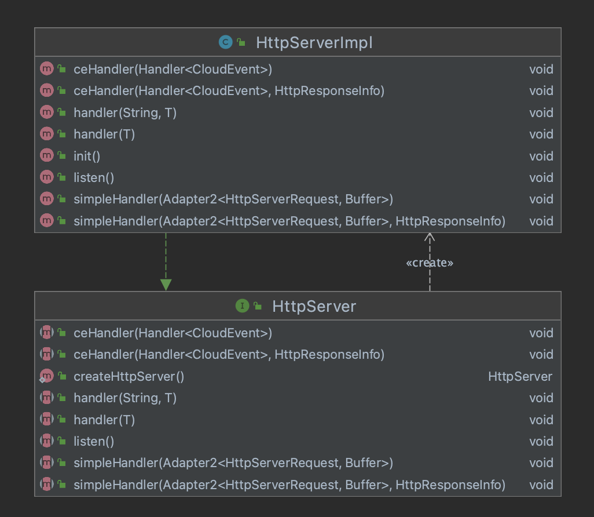

# HTTP Implementation

To speed up the development of a vance connector, the CDK offers a number of HTTP utilities.

## HttpServer



`HttpServer` allows you to easily create an HTTP server (based on [Vert.x]). 

```java
HttpServer server = HttpServer.createHttpServer();
```

### Getting notified of incoming requests

Your HttpServer should set a proper handler to get notified of incoming requests.

```
HttpServer server = HttpServer.createHttpServer();
server.
```

[Vert.x]: https://vertx.io/