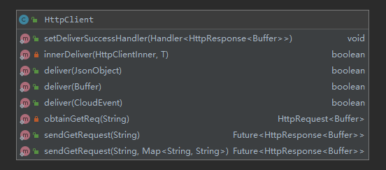

# HTTP Implementation

To speed up the development of a vance connector, the CDK offers a number of HTTP utilities.

## HttpServer


`HttpServer` allows you to easily create an HTTP server (based on [Vert.x]). 

```java
HttpServer server = HttpServer.createHttpServer();
```

### Getting notified of incoming requests

Your HttpServer should set a proper handler to get notified of incoming requests.

the CDK supports two types of handler:
#### simpleHandler
SimpleHandler helps you to receive and handle incoming http requests, parse data in the headers
and body of http and transform data into CloudEvents.
```java
/**
     * simpleHandler method helps you to handle incoming requests and deliver
     * CloudEvents to your target.
     * The only thing you need to provide is an adapter to specify how to
     * transform requests into a CloudEvent.
     * <p></p>
     * Also see {@link HttpServer#simpleHandler(Adapter2, HttpResponseInfo)} if
     * you want to specify your response details.
     * @param adapter
     */
    void simpleHandler(Adapter2<HttpServerRequest, Buffer> adapter);

    /**
     * Same as {@link HttpServer#simpleHandler(Adapter2)} but allows users to
     * specify their response details.
     * @param adapter
     * @param info
     */
    void simpleHandler(Adapter2<HttpServerRequest, Buffer> adapter, HttpResponseInfo info);
```
The implementation of simpleHandler:
```java
@Override
    public void simpleHandler(Adapter2<HttpServerRequest, Buffer> adapter) {
        simpleHandler(adapter,null);
    }

    @Override
    public void simpleHandler(Adapter2<HttpServerRequest, Buffer> adapter,  HttpResponseInfo info) {
        router.route("/").handler(context->{
            HttpServerRequest request = context.request();
            request.bodyHandler(buffer->{
                CloudEvent ce = adapter.adapt(request,buffer);
                boolean ret = HttpClient.deliver(ce);
                String vanceSink = ConfigUtil.getVanceSink();
                HttpResponseInfo i= info;
                if(null == info){
                    i = simHandlerRI;
                }

                request.response().setStatusCode(i.getSuccessCode());
                request.response().end(i.getSuccessChunk());

            });
        });
    }
```
The method `public void simpleHandler(Adapter2<HttpServerRequest, Buffer> adapter, 
HttpResponseInfo info) ` has mainly done three things:
1. Use Vert.x to get the http request;
2. Use Adapter to transform data in request into a CloudEvent;
3. Use HttpClient to deliver CloudEvent to VanceSink.
You can use httpServer with simpleHandler like below:
```java
HttpServer server = HttpServer.createHttpServer();
server.init();
server.simpleHandler((Adapter2<HttpServerRequest, Buffer>) getAdapter());
sever.liten();
``` 
It should be noted that simpleHandler can only deal with the simple case of extracting data from
http messages. If your source connector has more logic situations to deal with, it is better to 
use vert to process HTTP requests or implement the httpserver interface to customize the httpserver.  
#### ceHandler
CeHandler helps you to receive CloudEvents and allows you pass in your own processor to handle
CloudEvents in different situation.
```java
/**
     * If your HttpServe only receives CloudEvents, you can use this method to handle
     * received CloudEvents.
     * <p></p>
     * Also see {@link HttpServer#ceHandler(Handler, HttpResponseInfo)} if
     * you want to specify your response details.
     * @param handler
     */
    void ceHandler(Handler<CloudEvent> handler);

    /**
     * Same as {@link HttpServer#ceHandler(Handler)} but allows users to
     * specify their response details.
     * @param handler
     * @param info
     */
    void ceHandler(Handler<CloudEvent> handler,final HttpResponseInfo info);
```
The implementation of ceHandler:
```java
@Override
    public void ceHandler(Handler<CloudEvent> handler) {
        ceHandler(handler,null);
    }

    @Override
    public void ceHandler(Handler<CloudEvent> handler,  HttpResponseInfo info) {
        router.route("/").handler(context->{
            HttpServerRequest request = context.request();
            VertxMessageFactory.createReader(request)
                    .map(MessageReader::toEvent)
                    .onSuccess(handler)
                    .onSuccess(ce->{
                        HttpResponseInfo i= info;
                        if(null == info){
                            i = ceHandlerRI;
                        }
                        request.response().setStatusCode(i.getSuccessCode());
                        request.response().end(i.getSuccessChunk());
                    })
                    .onFailure(t->{
                        LOGGER.error("Receive a non-CloudEvent data");
                        HttpResponseInfo i= info;
                        if(null == info){
                            i = ceHandlerRI;
                        }
                        request.response().setStatusCode(i.getFailureCode());
                        request.response().end(i.getFailureChunk());
                    });
        });
    }
```
The method `public void ceHandler(Handler<CloudEvent> handler,  HttpResponseInfo info) ` 
has mainly done three things:
1. Use Vert.x to get the CloudEvents in http request;
2. Use your own handler to handle CloudEvents;
3. Make http response.
A simple example of using ceHandler is shown below. In this case you can see how to pass in your
own handler to handle CloudEvents.
```java
    HttpServer server = HttpServer.createHttpServer();
    // Use ceHandler method to tell HttpServer logics you want to do with an incoming CloudEvent
    server.ceHandler(event -> {
        int num = eventNum.addAndGet(1);
        // print number of received events
        LOGGER.info("receive a new event, in total: "+num);
        // Use JsonMapper to wrap a CloudEvent into a JsonObject for better printing
        JsonObject js = JsonMapper.wrapCloudEvent(event);
        LOGGER.info(js.encodePrettily());
    });
    server.listen();
```
## HttpClient



HttpClient provides methods to deliver CloudEvents to the http endpoints and to set handler 
for http response from http endpoints.
### Deliver methods
Deliver methods show below:
```java
public static boolean deliver(JsonObject json);
public static boolean deliver(Buffer buffer);
public static boolean deliver(CloudEvent event);
```
HttpClient is able to deliver JSON, Binary stream and CloudEvents to the http endpoints.
### HttpResponse handle methods
```java
public static void setDeliverSuccessHandler(Handler<HttpResponse<Buffer>> handler);
public static Future<HttpResponse<Buffer>> sendGetRequest(String uri);
public static Future<HttpResponse<Buffer>> sendGetRequest(String uri, Map<String,String> headers);
```
The `setDeliverSuccessHandler` method sets a handler to deal with the success http response. 
You can use the method to record logs like this:
```java
    HttpClient.setDeliverSuccessHandler(resp->{
        int num = eventNum.addAndGet(1);
        LOGGER.info("send event in total: "+num);
    });
```
The `sendGetRequest` method will return the http response result in the form of Future object.
You can handle the Future object to do the same thing as the `setDeliverSuccessHandler` method or 
handle the specific response results. 

## HttpResponseInfo
HttpResponseInfo is used to set response status code and message. HttpServer uses the code 
and message to respond to the client sending message.
The four attributes of HttpResponseInfo are:
```java
    private int successCode;
    private String successChunk;
    private int failureCode;
    private String failureChunk;
```
[Vert.x]: https://vertx.io/